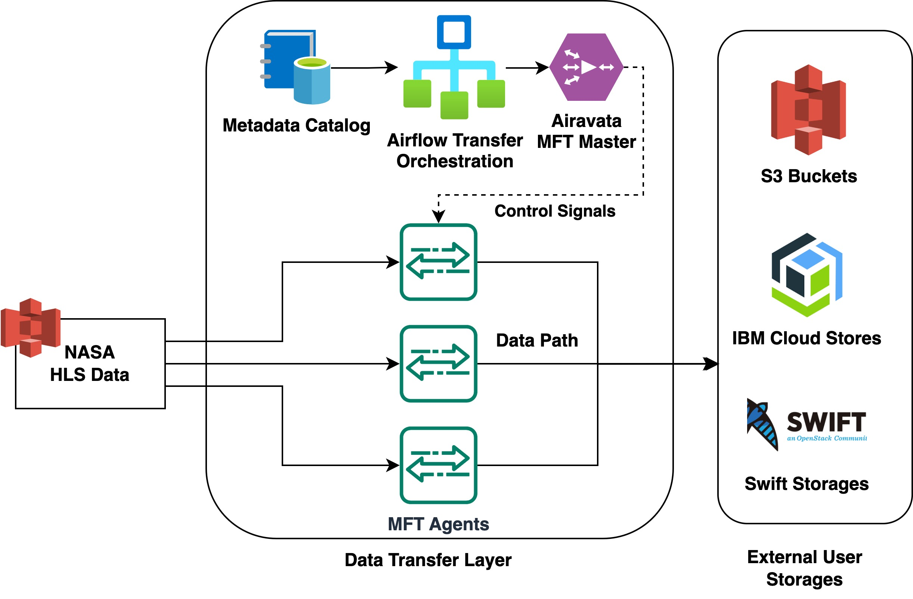
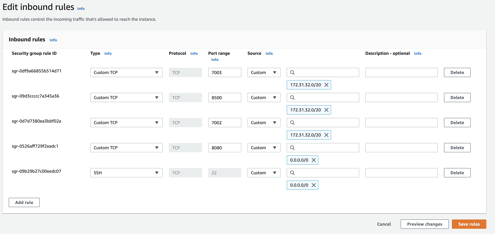
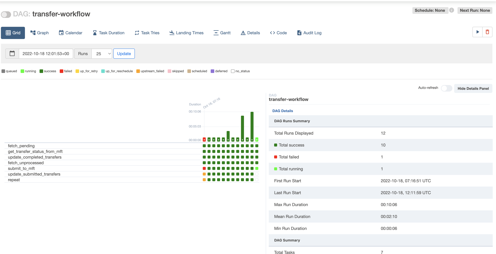

### Blaze: A High-Performance, Scalable, and Efficient Data Transfer Framework with Configurable and Extensible Features

### Transfer Architecture
The diagram below shows the top level transfer architecture of Blaze to move data from a S3 bucket to any cloud resource endpoint



### Overview
Blaze is a product with the integration of several software tools to build end-to-end data transfer workflows which includes
data preparation, transfers and post-processing. To accomplish that, Blaze uses following software

1. [Apache Airavata MFT](https://github.com/apache/airavata-mft) - This is the data transfer engine of Blaze. Airavata MFT provides a highly scalable and performing
agent based data transfer platform. Airavata MFT supports many cloud and legacy data transfer protocols and 
inter-protocol data translations which provide the capability to transfer data seamlessly between different storage types
2. [Apache Airflow](https://github.com/apache/airflow) - Blaze uses Airflow as the orchestration framework which executes the end to end data transfer workflow. 
Blaze provides example workflows with integration between MFT and Transfer Catalog and users have the liberty to update 
the workflow code according to their requirements
### Deployment

Deployment of the platform includes installation of the Data Transfer Layer mentioned in the above diagram and registering source and destination storages in the Data Transfer Layer

#### Prerequisites to deploy on EC2

To have a minimal transfer layer, there should be 2 EC2 VMs (one for MFT Master and one for MFT Agent) created inside us-west-2 region. These VMs should have following features
* Both should have a public host name / ip assigned to ssh from outside
* Both should share a private VPC with private ips for each VM
* Should be initialized with Ubuntu Server 22.04 LTS (HVM) image
* You need to be able to ssh into both VMs as ubuntu user
* The MFT-Master node need atleast 4 Vcpu's, 8 GiB Memory & 16 GB EBS.

#### Installation

* All installation scripts should be executed in the user's local work station which has SSH login access to all VMs mentioned above.
* Make a copy of scripts/inventories/example/hosts.example to scripts/inventories/example/hosts and update the hosts file with public ip, private ip and agent id fields accordingly. Private ip is the ip VM gets through the private VPC. Agent Id can be any unique integer number.
* Update security groups of master vm as below. Update 172.31.32.0/20 with the subnet of your VPC



* Next we install Master, Agent, and Endpoint Configurations through set of ansible scripts
* To setup the ansible environment, you need to have python3 installed in your laptop. For that, run following commands

```
cd scripts
python3 -m venv ENV
source ENV/bin/activate
pip install -r requirements.txt
```

* Install transfer orchestration components into the master node by running the following command

```
ansible-playbook -i inventories/example install-master.yml
```

* Install the transfer agent into the agent node
```
ansible-playbook -i inventories/example install-agents.yml
```
* To make sure that everything installed properly, go to http://<master-public-ip>:8080 from the browser and you should be able to see Airflow dashboard. Default username is airflow and default password is airflow. Make sure that you update the password immediately to secure the access

* If you are configuring a NASA S3 endpoint, you need to install and setup the transfer orchestration workflow. First, you need to have an account created at https://urs.earthdata.nasa.gov and installation script will ask for those credentials. This is required to generate access credentials for NASA S3 endpoint
```
ansible-playbook -i inventories/example configure-endpoints.yml
```
* While executing above ansible script, You will be asked to configure the destination storage endpoint in the MFT-Master node and get the storage_id. Here is an example of configuring a storage endpoint

Example storage creation command for AWS S3 cloud storage in us-west-2 region
```
java -jar /home/ubuntu/mft_deployment/mft-client.jar s3 remote add --name=<Name for the Storage> --bucket=<Bucket Name> --key=<key> --secret=<secret> --endpoint=https://s3.us-west-2.amazonaws.com --region=us-west-2
```
Example storage creation command for IBM cloud storage in us-east region
```
java -jar /home/ubuntu/mft_deployment/mft-client.jar s3 remote add --name=<Name for the Storage> --bucket=<Bucket Name> --key=<key> --secret=<secret>  --endpoint=https://s3.us-east.cloud-object-storage.appdomain.cloud --region=us-east-smart
```

* Then go back to Airflow dashboard, and you should be able to see a workflow named "transfer-workflow". Enable it and click the trigger workflow button in the top right corner. It will start transferring sample dataset mentioned in the scripts/roles/catalog/files/sample-data.csv

* Once you are able to see the data being transferred to destination storage, you can pause the transfer any time by clicking the toggle button present in the top left corner in the airflow transfer-workflow DAG page.


